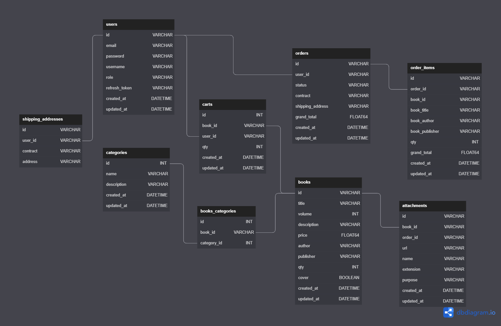

<h1>📚 Manga Store Project</h1>
<h3>🧑🏼‍💻 Established by</h3>
<ul>
    <li><strong>Ruangyot Nanchiang</strong></li>
</ul>

<h3>🚀 Version</h3>
<ul>
    <li><strong>1.0.0</strong></li>
</ul>

<h3>🌱 Status</h3>
<ul>
    <li><strong>In progress about 10%</strong></li>
</ul>

<h3>📃 Introduction</h3>
<ul>
    <li>This project is to build a REST API with Golang and GO Fiber using the clean architecture of Uncle Bob.</li>
</ul>

<h3>Requirements</h3>
<ul>
    <li>🐳 Dokcer</li>
    <li>⚡ GO v1.18+</li>
    <li>🐘 PostgreSQL</li>
    <li>🧑‍🚀 Postman</li>
</ul>

<h3>Install the postgreSQL on Docker</h3>
<ul>
<li>

<strong>Pull Image -> <a href="https://hub.docker.com/_/postgres" target="_blank">PostgreSQL Docker Image</a></strong>

```
docker pull postgres:alpine
```
</li>

<li>

<strong>Run the container</strong>

```
docker run --name postgres-manga-store -e POSTGRES_PASSWORD=123456 -p 3435:5432 -d postgres:alpine
```
</li>
<li>

<strong>Config the postgres</strong>

```
docker exec -it postgres-manga-store bash
```
```
psql -U postgres
```
```
create database manga_store_db;
```
</li>
<li>

<strong>Check the database that created or not</strong>

```
\l
```
```
      Name      |  Owner   | Encoding |  Collate   |   Ctype    |   Access privileges
----------------+----------+----------+------------+------------+-----------------------
 manga_store_db | postgres | UTF8     | en_US.utf8 | en_US.utf8 |
```
</li>
</ul>

<h3>💾 Database Schema</h3>


<h3>🔩 Initialize The Project (Just an example)</h3>
<ul>
    <li><strong>📂 app/</strong>
        <ul>
            <li>main.go</li>
        </ul>
    </li>
    <li><strong>📂 assets/</strong>
        <ul>
            <li><strong>📂 logs/</strong>
                <ul>
                    <li>2022-08-20T08:18:00.txt</li>
                    <li>2022-08-21T08:18:00.txt</li>
                    <li>2022-08-22T08:18:00.txt</li>
                </ul>
            </li>
        </ul>
    </li>
    <li><strong>📂 configs/</strong>
        <ul>
            <li>configs.go</li>
        </ul>
    </li>
    <li><strong>📂 internals/</strong>
        <ul>
            <li><strong>📂 entities/</strong>
                <ul>
                    <li>books.go</li>
                </ul>
            </li>
        </ul>
        <ul>
            <li><strong>📂 books/</strong>
                <ul>
                    <li><strong>📂 controllers/http/</strong>
                        <ul>
                            <li> book_controllers.go</li>
                        </ul>
                    </li>
                    <li><strong>📂 usecases/</strong>
                        <ul>
                            <li>book_services.go</li>
                        </ul>
                    </li>
                    <li><strong>📂 repositories/</strong>
                        <ul>
                            <li>book_repositories.go</li>
                        </ul>
                    </li>
                </ul>
            </li>
        </ul>
        <ul>
            <li><strong>📂 monitors/</strong>
                <ul>
                    <li><strong>📂 controllers/http/</strong>
                        <ul>
                            <li>monitor_controllers.go</li>
                        </ul>
                    </li>
                    <li><strong>📂 usecases/</strong>
                        <ul>
                            <li>monitor_services.go</li>
                        </ul>
                    </li>
                </ul>
            </li>
        </ul>
        <ul>
            <li><strong>📂 servers/</strong>
                <ul>
                    <li>handler.go</li>
                    <li>server.go</li>
                </ul>
            </li>
        </ul>
    </li>
    <li>.env</li>
</ul>